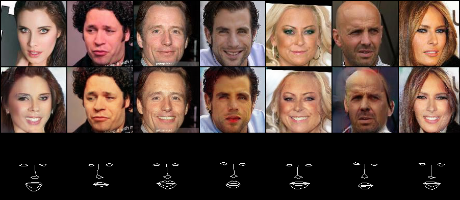

# Face rotation and facial transformation.

Recently, a number of papers have attempted to transformation faces. However, those papers require a specific set of data, such as MultiPIE, which are heavy and expensive! I wanted to have a similar effect with plain data sets.

I am still working on it, and the method and code will commit later.

## Requirements

- Python3
- Pytorch 1.0.0
- TensorBoardX

## Result

It is getting better.
