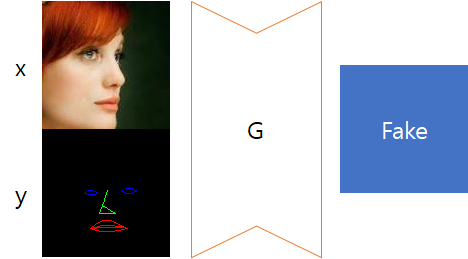

# Face rotation and facial expression transformation with GAN.

Recently, a number of papers have attempted to transformation faces. However, those papers require a specific set of data, such as MultiPIE, which are heavy and expensive! I wanted to have a similar effect with plain data sets.

I am still working on it, and the method and code will commit later.

## Approach

According to CycleGAN, cycle-consistency could be used to generate images of other domains that preserve features.

We want to convert faces within the same domain. The input is the face of the person and the output is the face of the person. Therefore, the generator will be a network using the face and facial landmark as arguments.

According to cGAN, conditional images can be generated by providing condition to generator and discriminator.

Finally, we use a pretrained face recognition network to preserve features by using cycle-consistency between target features and input features.

## Requirements

- Python3
- Pytorch 1.0.0
- TensorBoardX

## Result (using VGGFace2)

It is getting better.

## Reference

[LightCNN](https://github.com/AlfredXiangWu/LightCNN)

[CycleGAN](https://github.com/clcarwin/sphereface_pytorch)

[GAN_stability](https://github.com/LMescheder/GAN_stability)

## TODO list
- [ ] add pretrained weights
- [ ] add video samples
- [ ] add ambiguous conditional method
