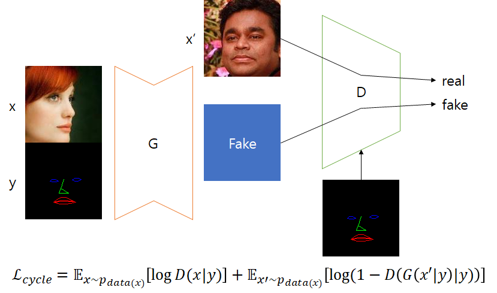
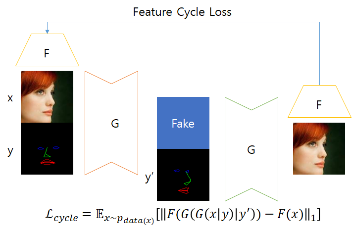

# Face rotation and facial expression transformation with GAN.

Recently, a number of papers have attempted to transformation faces. However, those papers require a specific set of data, such as MultiPIE, which are heavy and expensive! I wanted to have a similar effect with plain data sets.

I am still working on it, and the method and code will commit later.

## Approach

## Requirements

- Python3
- Pytorch 1.0.0
- TensorBoardX

## Result (using VGGFace2)

It is getting better.

## Reference

[LightCNN](https://github.com/AlfredXiangWu/LightCNN)

[CycleGAN](https://github.com/clcarwin/sphereface_pytorch)

[GAN_stability](https://github.com/LMescheder/GAN_stability)